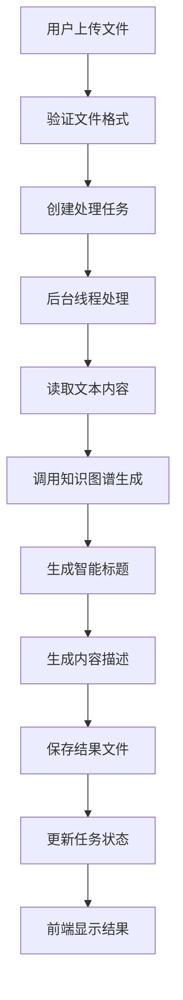

# AI知识图谱生成器 Web界面使用指南

## 🎯 概述

本Web界面为AI知识图谱生成器提供了用户友好的操作体验，支持文件上传、实时进度显示、智能内容命名和结果管理等功能。

## 🚀 快速启动

### 前置条件
1. **确保虚拟环境已激活**
   ```bash
   source venv/bin/activate
   ```

2. **安装Web依赖**
   ```bash
   pip install "Flask>=3.0.0" "Werkzeug>=3.0.0"
   ```

3. **确保Ollama服务运行**
   ```bash
   # 检查Ollama状态
   curl -s http://localhost:11434/api/tags
   ```

### 启动Web服务

**方法1：使用启动脚本（推荐）**
```bash
python start_web.py
```

**方法2：直接启动**
```bash
python web_app.py
```

启动成功后，访问：http://localhost:5000

## 🌟 功能特性

### 1. 智能文件上传
- **拖拽上传**：直接将.txt文件拖拽到上传区域
- **点击选择**：点击上传按钮选择文件
- **文件验证**：自动验证文件格式和大小（最大16MB）
- **实时预览**：显示文件名和大小信息

### 2. 实时进度显示
- **分阶段显示**：
  - 读取文本文件（10%）
  - 初始化处理（20%）
  - 提取知识三元组（40%）
  - 生成标题和描述（80%）
  - 完成处理（100%）
- **动态进度条**：实时更新处理进度
- **状态提示**：显示当前处理步骤

### 3. 智能内容命名
- **自动标题生成**：基于文本内容智能生成有意义的标题
- **描述生成**：结合内容和统计信息生成简洁描述
- **多语言支持**：中文文本生成中文标题，英文文本生成英文标题

### 4. 结果展示与管理
- **即时查看**：生成完成后可立即查看知识图谱
- **统计信息**：显示节点数、关系数、社区数等统计数据
- **多格式下载**：支持HTML和JSON格式下载
- **历史记录**：保存所有生成的知识图谱记录

## 📱 界面介绍

### 主页面
```
🏠 导航栏
├── AI知识图谱生成器 (首页)
└── 历史记录

📋 主要内容区
├── 标题介绍
├── 文件上传区域
├── 进度显示区域
├── 结果显示区域
└── 特性介绍
```

### 上传区域
- **可视化拖拽区域**：虚线边框，支持文件拖拽
- **文件信息显示**：选择文件后显示文件名和大小
- **上传按钮**：大型绿色按钮，引导用户操作

### 进度区域
- **进度条**：带动画的彩色进度条
- **百分比显示**：精确的进度百分比
- **步骤提示**：当前处理步骤的详细说明
- **加载动画**：旋转的处理指示器

### 结果区域
- **标题展示**：AI生成的智能标题
- **描述信息**：基于内容的简洁描述
- **统计数据**：节点、关系、社区数量
- **操作按钮**：查看图谱、下载文件

### 历史记录页面
- **卡片布局**：每个结果以卡片形式展示
- **时间排序**：按创建时间倒序排列
- **快速操作**：查看、下载HTML/JSON
- **统计概览**：节点、关系、社区数量一目了然

## 🔧 技术实现

### 后端架构（Flask）
```python
web_app.py
├── 文件上传处理 (/upload)
├── 任务状态查询 (/status/<task_id>)
├── 结果文件服务 (/result/<filename>)
├── 文件下载服务 (/download/<filename>)
└── 历史记录管理 (/results)
```

### 前端架构
```
templates/
├── index.html      # 主页面
└── results.html    # 历史记录页面

static/
├── css/style.css   # 样式文件
└── js/app.js       # 交互逻辑
```

### 核心功能
1. **异步任务处理**：使用Python threading进行后台处理
2. **实时状态更新**：JavaScript轮询获取任务状态
3. **文件管理**：自动清理临时文件，保存结果文件
4. **智能命名**：调用LLM生成标题和描述

## 📊 处理流程



## 🎨 UI/UX设计特点

### 现代化设计
- **Bootstrap 5**：响应式布局框架
- **Font Awesome**：丰富的图标库
- **渐变色彩**：现代感十足的视觉效果
- **卡片设计**：清晰的内容组织

### 交互体验
- **拖拽上传**：直观的文件上传方式
- **实时反馈**：即时的状态提示和进度显示
- **平滑动画**：淡入、悬停、过渡动画
- **响应式设计**：适配各种屏幕尺寸

### 用户引导
- **清晰的视觉层次**：重要信息突出显示
- **操作提示**：明确的按钮文字和图标
- **状态反馈**：成功、警告、错误提示
- **空状态处理**：友好的空数据页面

## 🔍 故障排除

### 常见问题

1. **Web服务无法启动**
   ```bash
   # 检查端口占用
   lsof -i :5000
   
   # 更换端口
   export FLASK_PORT=5001
   python web_app.py
   ```

2. **文件上传失败**
   - 检查文件格式（仅支持.txt）
   - 检查文件大小（最大16MB）
   - 确保虚拟环境已激活

3. **处理超时或失败**
   - 确认Ollama服务正常运行
   - 检查配置文件（config.toml）
   - 查看控制台错误信息

4. **生成的图谱无法打开**
   - 检查浏览器是否支持HTML5
   - 尝试使用不同浏览器
   - 确认文件权限正确

## 📁 文件结构

```
Web界面相关文件：
├── web_app.py              # 主Web应用
├── start_web.py            # 启动脚本
├── templates/              # HTML模板
│   ├── index.html         # 主页面
│   └── results.html       # 历史记录页面
├── static/                # 静态资源
│   ├── css/style.css      # 样式文件
│   └── js/app.js          # JavaScript
├── uploads/               # 临时上传文件夹
├── results/               # 生成结果文件夹
└── Web界面使用指南.md      # 本文档
```

## 🎯 使用建议

### 最佳实践
1. **文件准备**：确保文本文件编码为UTF-8
2. **内容质量**：提供结构化、有意义的文本内容
3. **文件大小**：建议单个文件不超过5MB以获得最佳性能
4. **定期清理**：及时下载重要结果，定期清理历史记录

### 性能优化
1. **硬件配置**：推荐8GB+内存，多核CPU
2. **模型选择**：根据硬件配置选择合适的AI模型
3. **并发控制**：避免同时处理多个大文件
4. **网络环境**：确保稳定的网络连接

## 🔮 未来扩展

### 计划功能
- [ ] 批量文件上传
- [ ] 实时文本输入
- [ ] 自定义可视化样式
- [ ] 用户账户系统
- [ ] 云端存储集成
- [ ] API接口开放

### 技术升级
- [ ] WebSocket实时通信
- [ ] 前端框架升级（Vue.js/React）
- [ ] 数据库持久化
- [ ] 容器化部署
- [ ] 负载均衡支持

---

**更新时间**：2024年6月4日  
**版本**：v1.0.0  
**兼容性**：Python 3.12+, 现代浏览器  
**维护状态**：积极开发中 